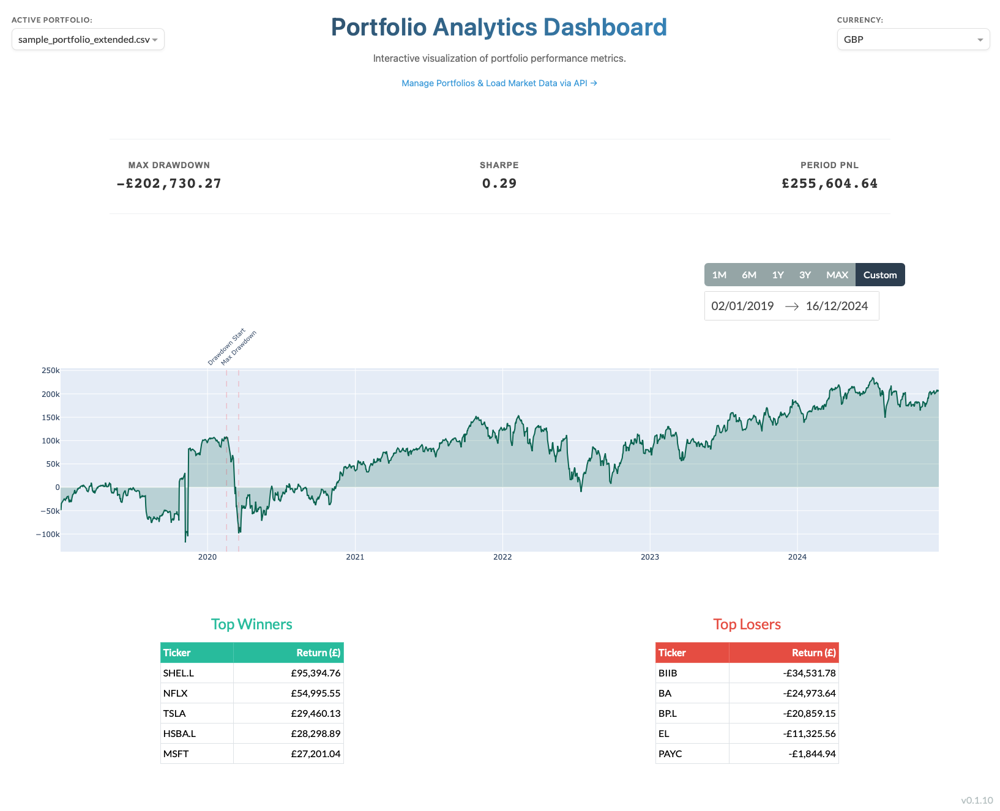
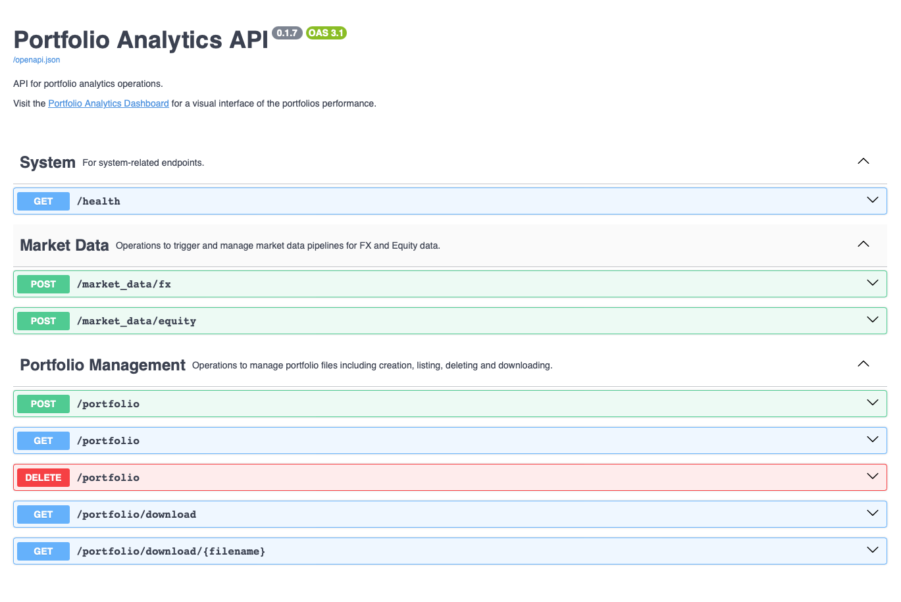

# Portfolio Analytics

[](https://github.com/gbourniq/portfolio-analytics/actions/workflows/ci.yml)
[](https://www.python.org/downloads/)
[](https://github.com/psf/black)
[](https://github.com/gbourniq/portfolio-analytics/actions)
[](https://codecov.io/gh/gbourniq/portfolio-analytics)

🌐 **Live Demo**: [dashboard.portfolio-analytics.click](dashboard.portfolio-analytics.click)

## Overview

A comprehensive portfolio management solution consisting of two main components:

### Interactive Dashboard



- Real-time portfolio performance visualization
- Key metrics tracking (Sharpe ratio, drawdown, PnL)
- Currency conversion support
- Customizable time period analysis

### REST API



- Portfolio management operations (create, list, delete)
- Market data integration for FX and Equity
- System health monitoring
- OpenAPI 3.1 compliant

## Getting Started

### Quick Start with Docker

```bash
# For Docker Compose V2
docker compose up

# For Docker Compose V1
docker-compose up
```

### Local Development

1. Install dependencies:

```bash
make install-deps
```

2. Start services:

```bash
python portfolio_analytics/dashboard/dashboard_main.py
python portfolio_analytics/api/api_main.py
```

## Future Improvements

### Data Pipeline

- Add historical index constituents tracking via a point-in-time security master database

### API Enhancements

- Implement asynchronous pipeline execution with DynamoDB tracking
- Add paginated portfolio listing endpoints

### Storage Optimization

- Migrate to S3 for blob storage
- Implement S3 pre-signed URLs for portfolio file operations

### Infrastructure

- Deploy containers to ECS or Kubernetes for improved scalability
- Implement automated pipeline scheduling system (Airflow). Currently relying on triggering the APIs manually.
